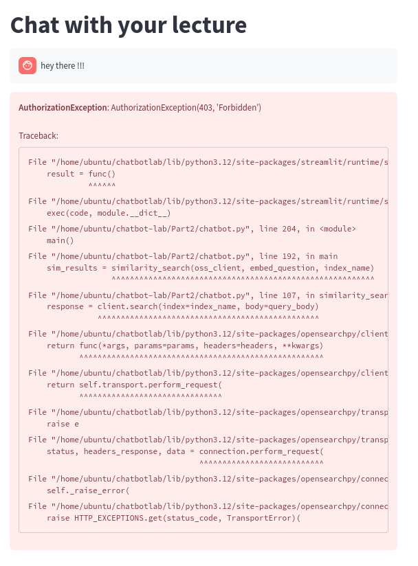
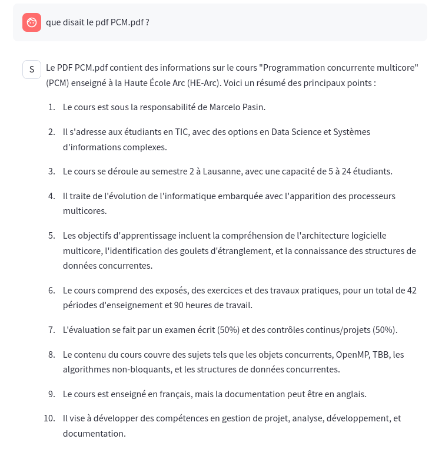

# Chatbot on AWS

**Authors**: Olivia Manz and Samuel Roland in **Group D**.

We successfully deployed the chatbot on AWS infrastructure, using the [given instructions](https://gitedu.hesge.ch/lsds/teaching/master/cloud/chatbot-lab).

We encountered an issue after having mixed up the regions.

We uploaded the course details of the PCM course (concurrent programming) and the chatbot is able to reply to our question about this document.

