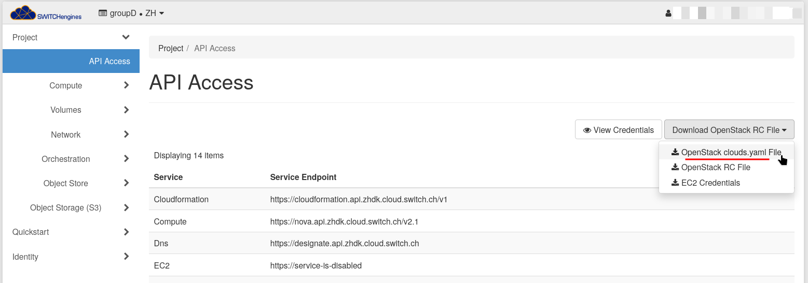
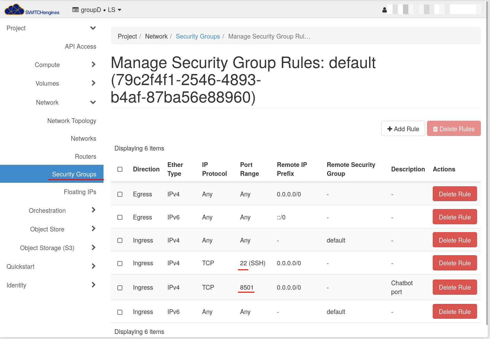
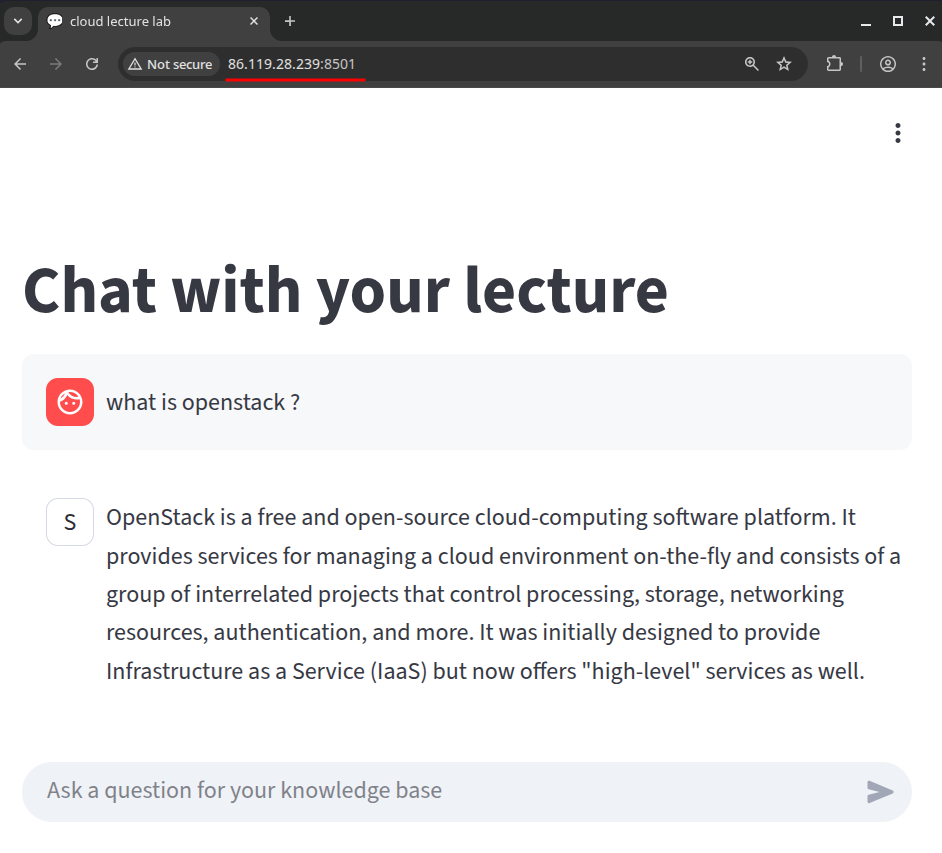

# Chatbot lab

## Goal
Using proprietary APIs of Cloud providers used from a single chatbot online. Based on the slides schemas, we updated the view with the 2 steps.

**First step**: Setup an S3 bucket on OpenStack, be able to download documents, send them to Google Vertex AI to get their embeddings equivalent. Then, we want to store these floats vectors into an Azure Cosmos DB database.


**Second step**: Deploy a chatbot based on given code, that has a streamlit chat interface that allows to ask a question about the vectorized documents. First the user request the bot has received, is sent to Google Vertex AI again to a model called `gemini-embedding-001`, the returned embedding is used to query a similarity search on Azure Cosmos DB. We want to take the 10 documents that are the most relevant to the user's query. This context is then given again to Google Vertex AI (with another model `gemini-2.5-flash-lite`). The final textual answer from Gemini 2.5 is sent back in the streamlit chat.


## Prerequisites
This assumes you have Python installed and you have access to the 3 following clouds: Google Cloud, Microsoft Azure and Switch Engines.

1. Install Python dependencies
    ```sh
    pip install -r requirements.txt
    ```
1. For Azure: [Install the Azure CLI `az`](https://learn.microsoft.com/en-us/cli/azure/install-azure-cli?view=azure-cli-latest) and run `az login`.
1. Setup the Google Cloud environment
    1. Create manually a [New project on GCloud](https://console.cloud.google.com/projectcreate) and get it's ID. For this example, we got `chatbot-475420`.
    1. Enable Google Vertex AI API [here](https://console.cloud.google.com/marketplace/product/google/aiplatform.googleapis.com)
    1. Install the GCloud CLI
    1. Login `gcloud auth login`
    1. Set the project `gcloud config set project chatbot-475420`
    1. Make it possible to access your credentials by Python code: `gcloud auth application-default login`

1. Setup the Switch Engines environment
    1. [Go login on Switch Engines panel](https://engines.switch.ch/) to get your generated API password
    1. Make sure you have the LS (Lausanne) region chosen not the ZH one...
    1. [Go into the API access page to get your `clouds.yaml`](https://engines.switch.ch/horizon/project/api_access/)
        
    1. Move this file under a `switch` subfolder in this directory
    1. Edit it to add your password
    1. An SSH keypair will be created automatically and downloaded under `switch/switchengine-tsm-cloudsys.pem` if it doesn't already exist.
    1. Change your `default` security group to accept port 22 (SSH) and 8501 (the chatbot).
        


## S3-compatible container creation on Switch engines
We know this wasn't 100% recommended by John White but we tried and it works.
```sh
python create-S3-and-put-docs_switch.py --container_name groupd --pdf_path ../../../TSM_CloudSys-2024-25.pdf
```
With this script, we create container in object store, upload an pdf. We can also download this pdf, list 
object storage and contents and delete a dedicated container.

## Vector database creation on Azure Cosmos DB service
We are going to use **Azure Cosmos DB** for this part. The home page of this service is here: [Create an Azure Cosmos DB account](https://portal.azure.com/#create/Microsoft.DocumentDB)

1. Then you can run the Python script that will 
    ```sh
    > python setup-azure.py
    Provisioned resource group groupd-chatbot-deploy
    Created Cosmos DB account: groupdchatbotd1234
    ```

1. Get the primary key in your portal and save it under a `azure-db-key.txt` file in this folder. This will be used for authentication for next scripts.


TODO: should we move the hardcoded values as program args ???


## Vectorizing the PDF Files
We want to download the files in S3 again, ask Google Vertex AI to generate embeddings and store them in a container in a database in Cosmos DB.

todo: even if not compatible with azure-cli ??

Just the script `vectorise-store.py` which is an adaptation of the provided script in the previous lab.
```sh
> python vectorise-store.py --account_name groupdchatbotd1234 --container_name "groupd-vector-container-cosmos" --local_path bucketcontent
TODO add --bucket_name in example
TODO: support injecting project_id ?
```

## Accessing the application locally
To make sure everything is working, there is a little `test.py` script that allows to quickly test the bot without open the streamlit chat. The message sent is hard-coded and can be changed if needed.

```sh
python test.py
```

If the AI is giving an answer and no Python stacktrace, it means everything is fully working. It's not possible to run the chatbot locally.
```sh
streamlit run chatbot.py
```

which should open your browser with a fully working bot. You can already ask questions about your vectorized PDFs.

## Create the instance on Switch Engines

Make sure to fill the `config.ini` file !
```sh
$ pip install openstacksdk
$ python create_instance_switch.py 
Create Server:
ssh -i ./switch/switchengine-tsm-cloudsys.pem ubuntu@2001:620:5ca1:2f0:f816:3eff:feae:87f8
List Servers:
groupd-labo1 - ACTIVE - 78f67707-26ab-4b57-8d6c-81c004df1853
```

These files will be used in the `create_instance_switch.py` script, which you can simply run with
```console
$ python create_instance_switch.py

Create Server:
ssh -i ./switch/switchengine-tsm-cloudsys.pem ubuntu@10.0.5.49
List Servers:
groupd-labo1 - ACTIVE - 496be91b-b1a9-4afd-8a78-996994e54e11
```

TODO fix the output with public IP !

Now an Ubuntu 22.04 instance of flavour `m1.small` should be running and accessible.


## Accessing the application online
You can finally open your browser, open the public IP of the VM with TODO




## Delete the infrastructure

Note: At the end of the lab, when you need to delete the Azure infrastructure, run this script (this can take several minutes to delete the resource group)
```sh
> python delete-azure.py
Cosmos DB account 'groupdchatbotdb1234' deleted successfully.
Resource group 'groupd-chatbot-deploy' deleted successfully.
```

TODO
You can delete the Switch VM and associated resource, with this command. Make sure to give the correct VM name.
```sh
> python create_instance_switch.py --delete-vm groupd-labo1
List Servers:
groupd-labo1 - ACTIVE - fcef1b69-83a8-4173-a399-8dcbd3758bb3
Server 'groupd-labo1' deleted
Floating IP 86.119.31.63 released
```
