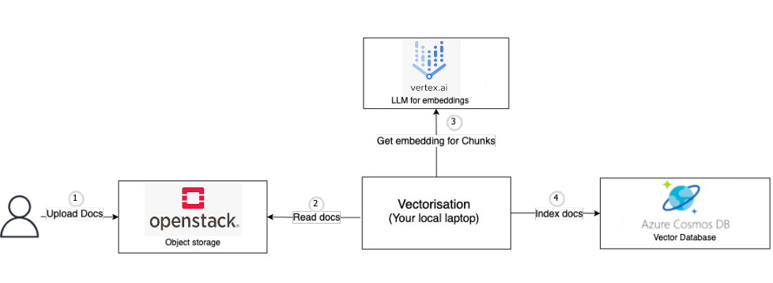
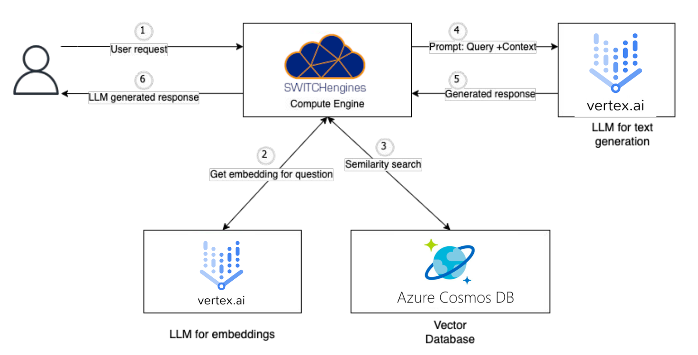
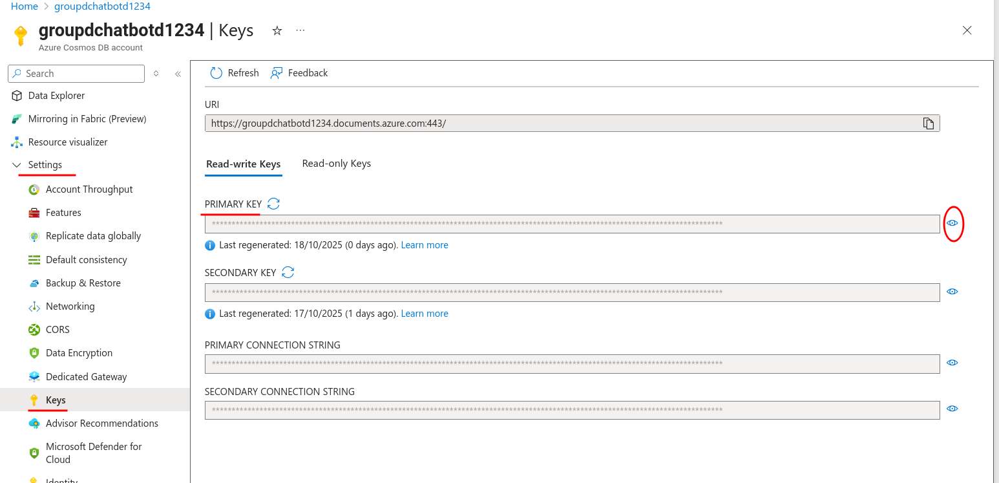

# Chatbot lab

## Goal
Using proprietary APIs of Cloud providers to develop a smart chatbot  



## Set up environment:
To access Switch Engine, add the `clouds.yaml` file to the switch folder.
TODO: how to generate this file
Also add the `switchengine-tsm-cloudsys.pem` key pair to the switch folder.
These files will be used in the `create_instance_switch.py` script.

TODO: create a requirement.txt file to install python lib?

## Object storage Creation
```sh
$ pip install openstacksdk
$ python create-S3-and-put-docs_switch.py --container_name groupd --pdf_path ../../../TSM_CloudSys-2024-25.pdf
```
With this script, we create container in object store, upload an pdf. We can also download this pdf, list 
object storage and contents and delete a dedicated container.

## Vector Store Creation
We are going to use **Azure Cosmos DB** for this part.
The home page of this service is here: [Create an Azure Cosmos DB account](https://portal.azure.com/#create/Microsoft.DocumentDB)

1. The first thing to do is to [install the Azure CLI `az`](https://learn.microsoft.com/en-us/cli/azure/install-azure-cli?view=azure-cli-latest) and run `az login`.
1. Install Python dependencies
    ```sh
    pip install -r requirements.txt
    ```
1. Then you can run the Python script that will 
    ```sh
    > python setup-azure.py
    Provisioned resource group groupd-chatbot-deploy
    Created Cosmos DB account: groupdchatbotd1234
    ```

1. Get the primary key in your portal and save it under a `azure-db-key.txt` file in this folder. This will be used for authentication for next scripts.



TODO: should we move the hardcoded values as program args ???

## Vectorizing the PDF Files
We want to download the files in S3 again, ask Google Vertex AI to generate embeddings and store them in a container in the Cosmos DB.

Setup the Google Cloud environment
1. Create manually a [New project on GCloud](https://console.cloud.google.com/projectcreate) and get it's ID. For this example, we got `chatbot-475420`.
1. Enable Google Vertex AI API [here](https://console.cloud.google.com/marketplace/product/google/aiplatform.googleapis.com)
1. Install the GCloud CLI
1. Login `gcloud auth login`
1. Set the project `gcloud config set project chatbot-475420`
1. Make it possible to access your credentials by Python code: `gcloud auth application-default login`

todo: even if not compatible with azure-cli ??
```sh
pip install --upgrade azure-cosmos
```

Just the script `vectorise-store.py` which is an adaptation of the provided script in the previous lab.
```sh
> python vectorise-store.py --account_name groupdchatbotd1234 --container_name "groupd-vector-container-cosmos" --local_path bucketcontent
TODO add --bucket_name in example
TODO: support injecting project_id ?
```

## Create switch Instance

Make sure to fill the `config.ini` file !
```sh
$ pip install openstacksdk
$ python create_instance_switch.py 
Create Server:
ssh -i ./switchengine-tsm-cloudsys.pem ubuntu@2001:620:5ca1:2f0:f816:3eff:feae:87f8
List Servers:
groupd-labo1 - ACTIVE - 78f67707-26ab-4b57-8d6c-81c004df1853
```

If needed, you can use the `delete_server` function in the same script.

## Accessing the application
TODO

## Delete the infrastructure

Note: At the end of the lab, when you need to delete the Azure infrastructure, run this script (this can take several minutes to delete the resource group)
```sh
> python delete-azure.py
Cosmos DB account 'groupdchatbotdb1234' deleted successfully.
Resource group 'groupd-chatbot-deploy' deleted successfully.
```
