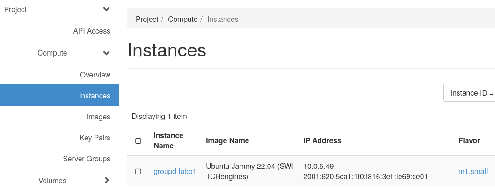

# Chatbot lab

## Goal
Using proprietary APIs of Cloud providers from a single online chatbot. Based on the slides schemas, we updated the 2 architecture diagrams.

**First step**: Setup an S3 bucket on OpenStack, be able to download documents, send them to Google Vertex AI to get their embeddings equivalent. Then, we want to store these floats vectors into an Azure Cosmos DB database.


**Second step**: Deploy a chatbot based on given code, that has a streamlit chat interface that allows to ask a question about the vectorized documents. First the user request the bot has received, is sent to Google Vertex AI again to a model called `gemini-embedding-001`, the returned embedding is used to query a similarity search on Azure Cosmos DB. We want to take the 10 documents that are the most relevant to the user's query. This context is then given again to Google Vertex AI (with another model `gemini-2.5-flash-lite`). The final textual answer from Gemini 2.5 is sent back in the streamlit chat.


Based on the code provided for the previous lab, we refactored the scripts for the new infrastructure, keeping mostly the same scripts separation strategy. The chatbot has the same strategy as the previous one but is using the new services. For ease of execution, we have chosen a few hard-coded values inside `config.ini` to avoid choosing and giving names. All values that cannot be chosen in advance (such as the public IP or the folder where you want to download PDFs), are provided via CLI flags.

## Prerequisites
This assumes you have Python installed and you have access to the 3 following clouds: Google Cloud, Microsoft Azure and Switch Engines.

1. **Install Python dependencies**
    ```sh
    pip install -r requirements.txt
    ```
1. **For Azure**: [Install the Azure CLI `az`](https://learn.microsoft.com/en-us/cli/azure/install-azure-cli?view=azure-cli-latest) and run `az login`.
1. **Setup the Google Cloud environment**
    1. Create manually a [New project on GCloud](https://console.cloud.google.com/projectcreate) and get it's ID. For this example, we got `chatbot-475420`.
    1. Enable Google Vertex AI API [here](https://console.cloud.google.com/marketplace/product/google/aiplatform.googleapis.com)
    1. You have to create a Service account, go in IAM, and create one like on this picture  
    

    1. Add **Vertex AI User** role and Continue with defaults.  
      

    1. Now you have a service account, click on it  
      

    1. Go in the Keys tab to **Add key** > Create new key  
    

    1. Download as JSON format  
    

    1. Place this JSON file under a file named `vertexai-service-account-key.json` in the current folder

1. **Setup the Switch Engines environment**
    1. [Go login on Switch Engines panel](https://engines.switch.ch/) to get your generated API password
    1. **Make sure you have the LS (Lausanne)** region chosen not the ZH one...
    1. [Go into the API access page to get your `clouds.yaml`](https://engines.switch.ch/horizon/project/api_access/)
          

    1. Move this file under a `switch` subfolder in this directory
    1. Edit it to add your password
    1. An SSH keypair will be created automatically and downloaded under `switch/switchengine-tsm-cloudsys.pem` if it doesn't already exist.
    1. Change your `default` security group to accept port 22 (SSH) and 8501 (the chatbot).
        

## S3-compatible container creation on Switch engines
We know this wasn't 100% recommended by John White but we tried and it works.
```sh
python manage-S3_switch.py --pdf_path ../../../TSM_CloudSys-2024-25.pdf
```
With this script, we create container in object store, upload an pdf. We can also download this pdf, list object storage and contents and delete a dedicated container.

## Vector database creation on Azure Cosmos DB service
We are going to use **Azure Cosmos DB** for this part. The home page of this service is here: [Create an Azure Cosmos DB account](https://portal.azure.com/#create/Microsoft.DocumentDB).

Note: the account name is also used as the database name. This name must be unique and can only 
<!-- TODO: should we change that ?? I didn't understand this was different at start so I mixed the 2 variables in code. -->

1. Activate the Cosmos DB service for your Azure account
 ```sh
az provider register --namespace Microsoft.DocumentDB
```
It may take 1–2 minutes to complete. You can check the registration status with the command:
 ```sh
az provider show --namespace Microsoft.DocumentDB --query "registrationState"
``` 
The command should return `Registered`

2. Then you can run
    ```console
    > python setup-azure.py
    Provisioned resource group groupd-chatbot-deploy
    Created Cosmos DB account: groupdchatbotd1234
    ```

1. Get the primary key in your portal and save it under a `azure-db-key.txt` file in this folder. This will be used for authentication for next scripts.


## Vectorizing the PDF Files
We want to download the files in S3 again, ask Google Vertex AI to generate embeddings and store them in a container in a database in Cosmos DB.

First download the pdf file from S3:
```console
$ python manage-S3_switch.py --download
Download TSM_CloudSys-2024-25.pdf in ./s3-download/TSM_CloudSys-2024-25.pdf...
TSM_CloudSys-2024-25.pdf downloaded successfully.
```

And run the script `vectorise-store.py` which is an adaptation of the provided script in the previous lab.
```sh
python vectorise-store.py --local_path s3-download
```

## Accessing the application locally
To make sure everything is working, there is a little `test.py` script that allows to quickly test the bot without open the streamlit chat. The message sent is hard-coded and can be changed if needed.

```sh
python test.py
```

If the AI is giving an answer and no Python stacktrace, it means everything is fully working. It's not possible to run the chatbot locally.
```sh
streamlit run chatbot.py
```

which should open your browser with a fully working bot. You can already ask questions about your vectorized PDFs.

## Create the instance on Switch Engines

Make sure to fill the `config.ini` file !  
These files will be used in the `manage_instance_switch.py` script, which you can simply run with
```console
$ python manage_instance_switch.py --create
List Servers:
Create Server:

VM 'groupd-labo1' created.
You can login with SSH in a minute with
ssh -i ./switch/switchengine-tsm-cloudsys.pem ubuntu@86.119.31.138
```

Now an Ubuntu 22.04 instance of flavour `m1.small` should be running and accessible. It take 1-2 minutes to be accessible via SSH.



## Deploy the chatbot on the VM
The VM is ready to host the chatbot. Get the hostname showed previously and run it like that
```console
$ python deploy.py --host 86.119.31.138

Uploading current folder into the VM
Starting deploy.sh on the VM

Hit:1 http://ch.archive.ubuntu.com/ubuntu jammy InRelease
Get:2 http://ch.archive.ubuntu.com/ubuntu jammy-updates InRelease [128 kB]
...
Defaulting to user installation because normal site-packages is not writeable
Collecting openstacksdk
  Downloading openstacksdk-4.7.1-py3-none-any.whl (1.8 MB)
     ━━━━━━━━━━━━━━━━━━━━━━━━━━━━━━━━━━━━━━━━ 1.8/1.8 MB 10.3 MB/s eta 0:00:00
Collecting azure-cosmos
  Downloading azure_cosmos-4.14.0-py3-none-any.whl (385 kB)

...

CHATBOT HAS BEEN DEPLOYED...
Please open http://86.119.31.138:8501 in your Web browser !
```

It installs Python, Pip, install the Pip dependencies, and start the chatbot in background.

You can finally open the link printed on the last line.


## Delete the infrastructure

At the end of the lab, when you need to delete the Azure infrastructure, run this script (this can take several minutes to delete the resource group)
```console
> python delete-azure.py
Cosmos DB account 'groupdchatbotdb1234' deleted successfully.
Resource group 'groupd-chatbot-deploy' deleted successfully.
```

You can delete the Switch VM and associated resource, with this command. Make sure to give the correct VM name.
```console
> python manage_instance_switch.py --delete-vm groupd-labo1
List Servers:
groupd-labo1 - ACTIVE - fcef1b69-83a8-4173-a399-8dcbd3758bb3
Server 'groupd-labo1' deleted
Floating IP 86.119.31.63 released
```

You can delete the S3 from Switch engine
```console
> python manage-S3_switch.py --delete
Deleted object: TSM_CloudSys-2024-25.pdf
Container 'groupd' deleted successfully.
```

The Google Cloud project `chatbot` could be deleted manually.

