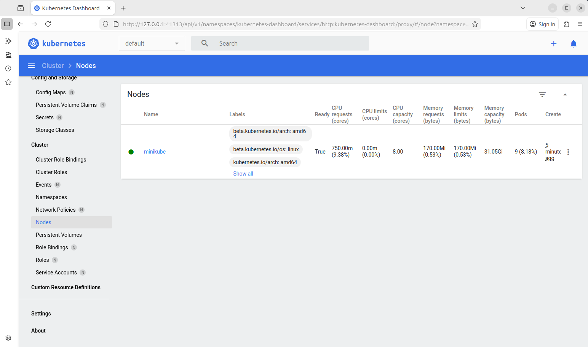
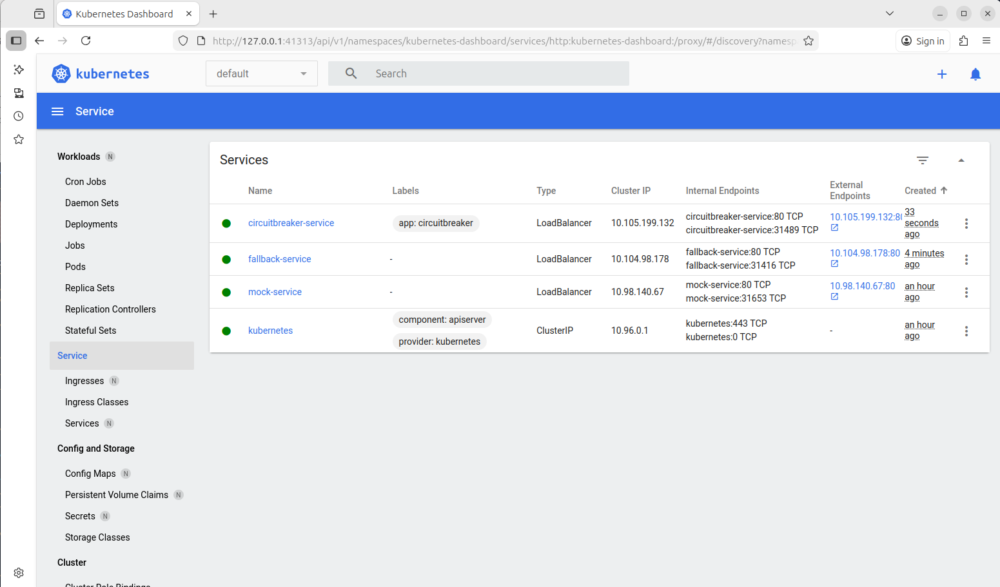

# Lab 4: Circuit Breaker pattern
**Authors**: Samuel Roland and Olivia Manz in **Group D**

# Introduction
In this lab, we will learn how to use NGINX Plus as a Circuit Breaker and become familiar with its mechanisms to detect when a service is about to fail or is already failing.
We will also learn how to deploy the Circuit Breaker pattern on Kubernetes.

See [the instructions](https://moodle.msengineering.ch/mod/assign/view.php?id=226466) if necessary.

    
# Task 1 - Set up Kubernetes cluster
We downloaded and installed Minikube on our our linux local machine.
```sh
curl -LO https://github.com/kubernetes/minikube/releases/latest/download/minikube-linux-amd64
sudo install minikube-linux-amd64 /usr/local/bin/minikube && rm minikube-linux-amd64
```
The cluster is started with the following command:
```console
> minikube start
😄  minikube v1.37.0 on Ubuntu 24.04
✨  Automatically selected the docker driver. Other choices: virtualbox, none, ssh
📌  Using Docker driver with root privileges
👍  Starting "minikube" primary control-plane node in "minikube" cluster
🚜  Pulling base image v0.0.48 ...
💾  Downloading Kubernetes v1.34.0 preload ...
    > gcr.io/k8s-minikube/kicbase...:  488.51 MiB / 488.52 MiB  100.00% 2.05 Mi
    > preloaded-images-k8s-v18-v1...:  337.07 MiB / 337.07 MiB  100.00% 1.02 Mi
🔥  Creating docker container (CPUs=2, Memory=7900MB) ...
🐳  Preparing Kubernetes v1.34.0 on Docker 28.4.0 ...
🔗  Configuring bridge CNI (Container Networking Interface) ...
🔎  Verifying Kubernetes components...
    ▪ Using image gcr.io/k8s-minikube/storage-provisioner:v5
🌟  Enabled addons: default-storageclass, storage-provisioner
🏄  Done! kubectl is now configured to use "minikube" cluster and "default" namespace by default

```
We check that our cluster is up and running:
```console
> minikube status
minikube
type: Control Plane
host: Running
kubelet: Running
apiserver: Running
kubeconfig: Configured
```
We list list the nodes of the cluster with `kubectl`
```console
> kubectl get nodes
NAME       STATUS   ROLES           AGE     VERSION
minikube   Ready    control-plane   2m44s   v1.34.0
```
Kubernetes dashboard can be launched with the command `minikube dashboard`, providing a web interface.
Here we can see the deployed nodes.



## Task 2 - Deploy services and Circuit Breaker
### 2.1 Deploy the mock webserver
After downloading the zip archive (`circuitbreaker.zip`) provided for this lab, we use the yaml file to deploy the provided container image of the mock webserver on Kubernetes.
```console
> cd circuitbreaker/
> kubectl create -f mock-webserver-deployment.yaml
deployment.apps/mock-webserver-deployment created
> kubectl get pods --output wide
NAME                                        READY   STATUS    RESTARTS   AGE     IP           NODE       NOMINATED NODE   READINESS GATES
mock-webserver-deployment-cf55b55bf-k8kj6   1/1     Running   0          8m51s   10.244.0.5   minikube   <none>           <none>
```
We create a Service to allocate a fixed IP address where the mock webserver is available as well as a corresponding domain name mock-service:
```console
> kubectl expose deployment mock-webserver-deployment --port=80 --type=LoadBalancer --name mock-service
service/mock-service exposed
```
We have to expose the Service (which is possibly running in a VM) to our host by creating a tunnel (this command should be run in a separate terminal and left running).
This will tunnel the existing Service and all future Services.
```console
> minikube tunnel
[sudo] password for fail: 
Status:	
	machine: minikube
	pid: 962553
	route: 10.96.0.0/12 -> 192.168.49.2
	minikube: Running
	services: [mock-service]
    errors: 
		minikube: no errors
		router: no errors
		loadbalancer emulator: no errors
```
Instead of using a tunnel, we could also use port forwarding; however, we would have to repeat that for every service we want to access, so we keep the tunnel solution for this lab.

We check informations about running services and their allocated IPs.
```console
> kubectl get services --watch
NAME           TYPE           CLUSTER-IP     EXTERNAL-IP    PORT(S)        AGE
kubernetes     ClusterIP      10.96.0.1      <none>         443/TCP        26m
mock-service   LoadBalancer   10.98.140.67   10.98.140.67   80:31653/TCP   2m21s
```
The mock webserver (`mock-service`) is available on `10.98.140.67`. We successfully test it:
```console
> curl -v http://10.98.140.67
*   Trying 10.98.140.67:80...
* Connected to 10.98.140.67 (10.98.140.67) port 80
> GET / HTTP/1.1
> Host: 10.98.140.67
> User-Agent: curl/8.5.0
> Accept: */*
> 
< HTTP/1.1 200 OK
< X-Powered-By: Express
< Content-Type: text/html; charset=utf-8
< Content-Length: 28
< ETag: W/"1c-XDxAG8I0L0SFWSklLB/40bK607A"
< Date: Wed, 31 Dec 2025 13:26:17 GMT
< Connection: keep-alive
< 
* Connection #0 to host 10.98.140.67 left intact
SOMERESPONSE FROM 10.244.0.5⏎
```
We also test the existing endpoints `/alive` and `/ready`:
```console
> curl -v http://10.98.140.67/alive
*   Trying 10.98.140.67:80...
* Connected to 10.98.140.67 (10.98.140.67) port 80
> GET /alive HTTP/1.1
> Host: 10.98.140.67
> User-Agent: curl/8.5.0
> Accept: */*
> 
< HTTP/1.1 200 OK
< X-Powered-By: Express
< Content-Type: text/html; charset=utf-8
< Content-Length: 2
< ETag: W/"2-nOO9QiTIwXgNtWtBJezz8kv3SLc"
< Date: Wed, 31 Dec 2025 13:28:35 GMT
< Connection: keep-alive
< 
* Connection #0 to host 10.98.140.67 left intact
OK⏎                                                                                                                                                      
> curl -v http://10.98.140.67/ready
*   Trying 10.98.140.67:80...
* Connected to 10.98.140.67 (10.98.140.67) port 80
> GET /ready HTTP/1.1
> Host: 10.98.140.67
> User-Agent: curl/8.5.0
> Accept: */*
> 
< HTTP/1.1 200 OK
< X-Powered-By: Express
< Content-Type: text/html; charset=utf-8
< Content-Length: 18
< ETag: W/"12-IVxdkC0Z1u7e1HfDz7v6Jf97KQM"
< Date: Wed, 31 Dec 2025 13:29:08 GMT
< Connection: keep-alive
< 
* Connection #0 to host 10.98.140.67 left intact
OK FROM 10.244.0.5⏎
```
We test a non-existing endpoint to check the `HTTP/1.1 404 Not Found` response:
```console
> curl -v http://10.98.140.67/dontexists
*   Trying 10.98.140.67:80...
* Connected to 10.98.140.67 (10.98.140.67) port 80
> GET /dontexists HTTP/1.1
> Host: 10.98.140.67
> User-Agent: curl/8.5.0
> Accept: */*
> 
< HTTP/1.1 404 Not Found
< X-Powered-By: Express
< Content-Security-Policy: default-src 'none'
< X-Content-Type-Options: nosniff
< Content-Type: text/html; charset=utf-8
< Content-Length: 149
< Date: Wed, 31 Dec 2025 13:29:34 GMT
< Connection: keep-alive
< 
<!DOCTYPE html>
<html lang="en">
<head>
<meta charset="utf-8">
<title>Error</title>
</head>
<body>
<pre>Cannot GET /dontexists</pre>
</body>
</html>
* Connection #0 to host 10.98.140.67 left intact
```

We set the mock webserver into simulated overload mode by sending a POST request to `/fakeerrormodeon`:
```console
> curl --data "" --silent --dump-header - http://10.98.140.67/fakeerrormodeon
HTTP/1.1 200 OK
X-Powered-By: Express
Content-Type: text/html; charset=utf-8
Content-Length: 18
ETag: W/"12-IVxdkC0Z1u7e1HfDz7v6Jf97KQM"
Date: Wed, 31 Dec 2025 13:36:06 GMT
Connection: keep-alive

OK FROM 10.244.0.5⏎                                           
```
We probe the endpoints `/`, `/alive`, and `/ready` again and observe different responses:
- `/`: responds after 30 seconds, shows an error `503 Service Unavailable`
- `/alive`: responds immediately with `200 OK`
- `/ready`: responds immediately with the error `503 Service Unavailable`

```console
> curl -v http://10.98.140.67/
*   Trying 10.98.140.67:80...
* Connected to 10.98.140.67 (10.98.140.67) port 80
> GET / HTTP/1.1
> Host: 10.98.140.67
> User-Agent: curl/8.5.0
> Accept: */*
> 
< HTTP/1.1 503 Service Unavailable
< X-Powered-By: Express
< Content-Type: text/html; charset=utf-8
< Content-Length: 21
< ETag: W/"15-7Nqs4NwLCGt2ziqcJZorBOlHRbo"
< Date: Wed, 31 Dec 2025 13:37:56 GMT
< Connection: keep-alive
< 
* Connection #0 to host 10.98.140.67 left intact
ERROR FROM 10.244.0.5⏎                                                                                                                                   

> curl -v http://10.98.140.67/alive
*   Trying 10.98.140.67:80...
* Connected to 10.98.140.67 (10.98.140.67) port 80
> GET /alive HTTP/1.1
> Host: 10.98.140.67
> User-Agent: curl/8.5.0
> Accept: */*
> 
< HTTP/1.1 200 OK
< X-Powered-By: Express
< Content-Type: text/html; charset=utf-8
< Content-Length: 2
< ETag: W/"2-nOO9QiTIwXgNtWtBJezz8kv3SLc"
< Date: Wed, 31 Dec 2025 13:38:41 GMT
< Connection: keep-alive
< 
* Connection #0 to host 10.98.140.67 left intact
OK⏎                                                                                                                                                      

> curl -v http://10.98.140.67/ready
*   Trying 10.98.140.67:80...
* Connected to 10.98.140.67 (10.98.140.67) port 80
> GET /ready HTTP/1.1
> Host: 10.98.140.67
> User-Agent: curl/8.5.0
> Accept: */*
> 
< HTTP/1.1 503 Service Unavailable
< X-Powered-By: Express
< Content-Type: text/html; charset=utf-8
< Content-Length: 20
< ETag: W/"14-losV1iHnPegUY0eSzbbYnwLSkQ4"
< Date: Wed, 31 Dec 2025 13:39:34 GMT
< Connection: keep-alive
< 
* Connection #0 to host 10.98.140.67 left intact
BUSY FROM 10.244.0.5⏎     
```
The different endpoints are useful to distinguish whether the server is down or has crashed (`/alive`) or it overloaded (`/ready` or `\`).

We put the webserver back into normal mode by sending a POST request to /fakeerrormodeoff.
```console
> curl --data "" --silent --dump-header - http://10.98.140.67/fakeerrormodeoff
HTTP/1.1 200 OK
X-Powered-By: Express
Content-Type: text/html; charset=utf-8
Content-Length: 18
ETag: W/"12-IVxdkC0Z1u7e1HfDz7v6Jf97KQM"
Date: Wed, 31 Dec 2025 13:42:00 GMT
Connection: keep-alive

OK FROM 10.244.0.5⏎                                         
```
We successfully check the normal state by sending queries to `/` and `/ready` endpoints.
```console
> curl -v http://10.98.140.67/ready
*   Trying 10.98.140.67:80...
* Connected to 10.98.140.67 (10.98.140.67) port 80
> GET /ready HTTP/1.1
> Host: 10.98.140.67
> User-Agent: curl/8.5.0
> Accept: */*
> 
< HTTP/1.1 200 OK
< X-Powered-By: Express
< Content-Type: text/html; charset=utf-8
< Content-Length: 18
< ETag: W/"12-IVxdkC0Z1u7e1HfDz7v6Jf97KQM"
< Date: Wed, 31 Dec 2025 13:42:20 GMT
< Connection: keep-alive
< 
* Connection #0 to host 10.98.140.67 left intact
OK FROM 10.244.0.5⏎                                                                                                                                      

> curl -v http://10.98.140.67/
*   Trying 10.98.140.67:80...
* Connected to 10.98.140.67 (10.98.140.67) port 80
> GET / HTTP/1.1
> Host: 10.98.140.67
> User-Agent: curl/8.5.0
> Accept: */*
> 
< HTTP/1.1 200 OK
< X-Powered-By: Express
< Content-Type: text/html; charset=utf-8
< Content-Length: 28
< ETag: W/"1c-XDxAG8I0L0SFWSklLB/40bK607A"
< Date: Wed, 31 Dec 2025 13:42:23 GMT
< Connection: keep-alive
< 
* Connection #0 to host 10.98.140.67 left intact
SOMERESPONSE FROM 10.244.0.5⏎                                        
```
### 2.2 Deploy the fallback service
Based on the Deployment specification of the mock webserver, we create a new Deployment for the fallback service called fallback-webserver-deployment.yaml. 
- Deployment name: mock-webserver-deployment -> fallback-webserver-deployment
- Pod app label: mock-webserver -> fallback-webserver
- Container name: mock-webserver -> fallback-webserver

The `fallback-webserver-deployment.yaml` file becomes:
```yaml
# Mock webserver deployment
apiVersion: apps/v1
kind: Deployment
metadata:
  name: fallback-webserver-deployment
spec:
  # For simplicity we'll just fire up a single replica
  replicas: 1
  selector:
    matchLabels:
      app: fallback-webserver
  template:
    metadata:
      labels:
        app: fallback-webserver
    spec:
      containers:
      - name: fallback-webserver
        image: grafolytics/mock-webserver
        ports:
        - containerPort: 80
        livenessProbe:
          httpGet:
            path: /alive
            port: 80
            scheme: HTTP
          initialDelaySeconds: 5
          periodSeconds: 10
```
We create the fallback-webserver and check its status:
```console
> kubectl create -f fallback-webserver-deployment.yaml
deployment.apps/fallback-webserver-deployment created
> kubectl get pods --output wide
NAME                                           READY   STATUS    RESTARTS   AGE   IP           NODE       NOMINATED NODE   READINESS GATES
fallback-webserver-deployment-d7ff868f-c5kzn   1/1     Running   0          47s   10.244.0.7   minikube   <none>           <none>
mock-webserver-deployment-cf55b55bf-k8kj6      1/1     Running   0          83m   10.244.0.5   minikube   <none>           <none>
```
We create a Service for the this fallback pod:
```console
> kubectl expose deployment fallback-webserver-deployment --port=80 --type=LoadBalancer --name fallback-service
service/fallback-service exposed
```
We check the availability and IP of our service:
```console
> kubectl get services --watch
NAME               TYPE           CLUSTER-IP      EXTERNAL-IP     PORT(S)        AGE
fallback-service   LoadBalancer   10.104.98.178   10.104.98.178   80:31416/TCP   17s
kubernetes         ClusterIP      10.96.0.1       <none>          443/TCP        102m
mock-service       LoadBalancer   10.98.140.67    10.98.140.67    80:31653/TCP   78m
```
We verify that we can reach the container at `10.104.98.178` through its endpoints:
```console
> curl -v http://10.104.98.178/
*   Trying 10.104.98.178:80...
* Connected to 10.104.98.178 (10.104.98.178) port 80
> GET / HTTP/1.1
> Host: 10.104.98.178
> User-Agent: curl/8.5.0
> Accept: */*
> 
< HTTP/1.1 200 OK
< X-Powered-By: Express
< Content-Type: text/html; charset=utf-8
< Content-Length: 28
< ETag: W/"1c-eOCWkVRivooGShcfDeBpuL5b7Qs"
< Date: Wed, 31 Dec 2025 14:39:58 GMT
< Connection: keep-alive
< 
* Connection #0 to host 10.104.98.178 left intact
SOMERESPONSE FROM 10.244.0.7⏎                                                                                                                            

> curl -v http://10.104.98.178/alive
*   Trying 10.104.98.178:80...
* Connected to 10.104.98.178 (10.104.98.178) port 80
> GET /alive HTTP/1.1
> Host: 10.104.98.178
> User-Agent: curl/8.5.0
> Accept: */*
> 
< HTTP/1.1 200 OK
< X-Powered-By: Express
< Content-Type: text/html; charset=utf-8
< Content-Length: 2
< ETag: W/"2-nOO9QiTIwXgNtWtBJezz8kv3SLc"
< Date: Wed, 31 Dec 2025 14:40:15 GMT
< Connection: keep-alive
< 
* Connection #0 to host 10.104.98.178 left intact
OK⏎                                                                                                                                                      

> curl -v http://10.104.98.178/ready
*   Trying 10.104.98.178:80...
* Connected to 10.104.98.178 (10.104.98.178) port 80
> GET /ready HTTP/1.1
> Host: 10.104.98.178
> User-Agent: curl/8.5.0
> Accept: */*
> 
< HTTP/1.1 200 OK
< X-Powered-By: Express
< Content-Type: text/html; charset=utf-8
< Content-Length: 18
< ETag: W/"12-/IkEMwTn0MUikZnoxEx3g0Mo+hQ"
< Date: Wed, 31 Dec 2025 14:40:21 GMT
< Connection: keep-alive
< 
* Connection #0 to host 10.104.98.178 left intact
OK FROM 10.244.0.7⏎              
```

### 2.3 Deploy the Circuit Breaker
We store the ConfigMap in Kubernetes:
```console
> kubectl create -f nginx-configmap.yaml
configmap/nginx-configuration created
```
As the NGINX Plus container image is a commercial product, we provide the key as a Secret:
```console
> kubectl create secret generic regcred \
         --from-file=.dockerconfigjson=docker-token \
         --type=kubernetes.io/dockerconfigjson
secret/regcred created
```
We verify the Secret and see in the output the content of the docker-token file.
```console
> kubectl get secret regcred --output=yaml
apiVersion: v1
data:
  .dockerconfigjson: ewogI... <REDACTED>
kind: Secret
metadata:
  creationTimestamp: "2025-12-31T14:13:09Z"
  name: regcred
  namespace: default
  resourceVersion: "4221"
  uid: befe5d4e-c678-4df2-9e27-e2b55092f83c
type: kubernetes.io/dockerconfigjson
```
We are now ready to deploy the NGINX container:
```console
> kubectl create -f circuitbreaker.yaml
deployment.apps/circuitbreaker-deployment created
service/circuitbreaker-service created
```
We observes the new `circuitbreaker` service:
```console
> kubectl get services --watch
NAME                     TYPE           CLUSTER-IP       EXTERNAL-IP      PORT(S)        AGE
circuitbreaker-service   LoadBalancer   10.105.199.132   10.105.199.132   80:31489/TCP   13s
fallback-service         LoadBalancer   10.104.98.178    10.104.98.178    80:31416/TCP   3m50s
kubernetes               ClusterIP      10.96.0.1        <none>           443/TCP        106m
mock-service             LoadBalancer   10.98.140.67     10.98.140.67     80:31653/TCP   82m
```
Services can also be checked via the Kubernetes dashboard:


To get the full pods names, status and internal IPs, we use the following command:
```console
> kubectl get pods --output wide
NAME                                           READY   STATUS    RESTARTS   AGE     IP           NODE       NOMINATED NODE   READINESS GATES
circuitbreaker-deployment-7dcd96997f-tbkxv     1/1     Running   0          9m58s   10.244.0.8   minikube   <none>           <none>
fallback-webserver-deployment-d7ff868f-c5kzn   1/1     Running   0          19m     10.244.0.7   minikube   <none>           <none>
mock-webserver-deployment-cf55b55bf-k8kj6      1/1     Running   0          102m    10.244.0.5   minikube   <none>           <none>
```

Using `curl`, we send requests to the Circuit Breaker and to the mock webserver.  
Reminder: `10.98.140.67` is the mock webserver and `10.105.199.132` is the circuit breaker.
The internal IP of the mock webserver is `10.244.0.5`.
```console
> curl -v http://10.98.140.67
*   Trying 10.98.140.67:80...
* Connected to 10.98.140.67 (10.98.140.67) port 80
> GET / HTTP/1.1
> Host: 10.98.140.67
> User-Agent: curl/8.5.0
> Accept: */*
> 
< HTTP/1.1 200 OK
< X-Powered-By: Express
< Content-Type: text/html; charset=utf-8
< Content-Length: 28
< ETag: W/"1c-XDxAG8I0L0SFWSklLB/40bK607A"
< Date: Wed, 31 Dec 2025 14:47:27 GMT
< Connection: keep-alive
< 
* Connection #0 to host 10.98.140.67 left intact
SOMERESPONSE FROM 10.244.0.5⏎                                                                                                                            

> curl -v http://10.105.199.132
*   Trying 10.105.199.132:80...
* Connected to 10.105.199.132 (10.105.199.132) port 80
> GET / HTTP/1.1
> Host: 10.105.199.132
> User-Agent: curl/8.5.0
> Accept: */*
> 
< HTTP/1.1 200 OK
< Server: nginx/1.21.3
< Date: Wed, 31 Dec 2025 14:47:40 GMT
< Content-Type: text/html; charset=utf-8
< Content-Length: 28
< Connection: keep-alive
< X-Powered-By: Express
< ETag: W/"1c-XDxAG8I0L0SFWSklLB/40bK607A"
< 
* Connection #0 to host 10.105.199.132 left intact
SOMERESPONSE FROM 10.244.0.5⏎         
```
We can send curl requests to the circuit breaker or directly to the external ip of the mock webserver, the response comes from the internal IP of the mock webserver pod (`10.244.0.5`), confirming that the Circuit Breaker correctly redirected the requests.

The Circuit Breaker log is available with the following command:
```console
> kubectl logs pod/circuitbreaker-deployment-7dcd96997f-tbkxv
2025/12/31 14:42:17 [notice] 1#1: using the "epoll" event method
2025/12/31 14:42:17 [notice] 1#1: nginx/1.21.3 (nginx-plus-r25-p1)
2025/12/31 14:42:17 [notice] 1#1: built by gcc 10.2.1 20210110 (Debian 10.2.1-6) 
2025/12/31 14:42:17 [notice] 1#1: OS: Linux 6.8.0-90-generic
2025/12/31 14:42:17 [notice] 1#1: getrlimit(RLIMIT_NOFILE): 1048576:1048576
2025/12/31 14:42:17 [notice] 1#1: start worker processes
2025/12/31 14:42:17 [notice] 1#1: start worker process 7
2025/12/31 14:42:17 [notice] 1#1: start worker process 8
2025/12/31 14:42:17 [notice] 1#1: start worker process 9
2025/12/31 14:42:17 [notice] 1#1: start worker process 10
2025/12/31 14:42:17 [notice] 1#1: start worker process 11
2025/12/31 14:42:17 [notice] 1#1: start worker process 12
2025/12/31 14:42:17 [notice] 1#1: start worker process 13
2025/12/31 14:42:17 [notice] 1#1: start worker process 14
10.244.0.1 - - [31/Dec/2025:14:47:40 +0000] "GET / HTTP/1.1" 200 28 "-" "curl/8.5.0" "-"
```
### Task 3 - Exercise the Circuit Breaker
We activate overload mode on the mock webserver:
```console
> curl --data "" --silent --dump-header - http://10.98.140.67/fakeerrormodeon
HTTP/1.1 200 OK
X-Powered-By: Express
Content-Type: text/html; charset=utf-8
Content-Length: 18
ETag: W/"12-IVxdkC0Z1u7e1HfDz7v6Jf97KQM"
Date: Wed, 31 Dec 2025 14:56:33 GMT
Connection: keep-alive

OK FROM 10.244.0.5⏎                                                                               
```
After a few seconds, we send a request to the Circuit Breaker:
```console
> curl -v http://10.105.199.132
*   Trying 10.105.199.132:80...
* Connected to 10.105.199.132 (10.105.199.132) port 80
> GET / HTTP/1.1
> Host: 10.105.199.132
> User-Agent: curl/8.5.0
> Accept: */*
> 
< HTTP/1.1 200 OK
< Server: nginx/1.21.3
< Date: Wed, 31 Dec 2025 14:57:21 GMT
< Content-Type: text/html; charset=utf-8
< Content-Length: 28
< Connection: keep-alive
< X-Powered-By: Express
< ETag: W/"1c-eOCWkVRivooGShcfDeBpuL5b7Qs"
< 
* Connection #0 to host 10.105.199.132 left intact
SOMERESPONSE FROM 10.244.0.7⏎                                     
```
The response now comes from `10.244.0.7`, which is the fallback-webserver internal IP.
The Circuit Breaker logs indicates the mock webserver is unhealty. However, logs for the `curl`request do not contain specific information about the redirection.
```console
2025/12/31 14:56:33 [warn] 7#7: peer is unhealthy while checking status code, health check "" of peer 10.98.140.67:80 in upstream "backend"
10.244.0.1 - - [31/Dec/2025:14:57:21 +0000] "GET / HTTP/1.1" 200 28 "-" "curl/8.5.0" "-"
```
We put the mock webserver back into normal mode:
```console
> curl --data "" --silent --dump-header - http://10.98.140.67/fakeerrormodeoff
HTTP/1.1 200 OK
X-Powered-By: Express
Content-Type: text/html; charset=utf-8
Content-Length: 18
ETag: W/"12-IVxdkC0Z1u7e1HfDz7v6Jf97KQM"
Date: Wed, 31 Dec 2025 15:01:29 GMT
Connection: keep-alive

OK FROM 10.244.0.5⏎                                           
```
After a few seconds, we send a request to the Circuit Breaker:
```console
> curl -v http://10.105.199.132
*   Trying 10.105.199.132:80...
* Connected to 10.105.199.132 (10.105.199.132) port 80
> GET / HTTP/1.1
> Host: 10.105.199.132
> User-Agent: curl/8.5.0
> Accept: */*
> 
< HTTP/1.1 200 OK
< Server: nginx/1.21.3
< Date: Wed, 31 Dec 2025 15:01:57 GMT
< Content-Type: text/html; charset=utf-8
< Content-Length: 28
< Connection: keep-alive
< X-Powered-By: Express
< ETag: W/"1c-XDxAG8I0L0SFWSklLB/40bK607A"
< 
* Connection #0 to host 10.105.199.132 left intact
SOMERESPONSE FROM 10.244.0.5⏎                                         
```
The response now comes from `10.244.0.5`, which is the mock webserver internal IP. 
The Circuit Breaker log indicates about the mock webserver is healthy again.
```console
2025/12/31 15:01:31 [notice] 7#7: peer is healthy while checking status code, health check "" of peer 10.98.140.67:80 in upstream "backend"
10.244.0.1 - - [31/Dec/2025:15:01:57 +0000] "GET / HTTP/1.1" 200 28 "-" "curl/8.5.0" "-"
```
Here is the full Circuit Breaker log, including startup, initial health checks, fallback during overload, and the restoration of the mock webserver:
```console
> kubectl logs pod/circuitbreaker-deployment-7dcd96997f-tbkxv
2025/12/31 14:42:17 [notice] 1#1: using the "epoll" event method
2025/12/31 14:42:17 [notice] 1#1: nginx/1.21.3 (nginx-plus-r25-p1)
2025/12/31 14:42:17 [notice] 1#1: built by gcc 10.2.1 20210110 (Debian 10.2.1-6) 
2025/12/31 14:42:17 [notice] 1#1: OS: Linux 6.8.0-90-generic
2025/12/31 14:42:17 [notice] 1#1: getrlimit(RLIMIT_NOFILE): 1048576:1048576
2025/12/31 14:42:17 [notice] 1#1: start worker processes
2025/12/31 14:42:17 [notice] 1#1: start worker process 7
2025/12/31 14:42:17 [notice] 1#1: start worker process 8
2025/12/31 14:42:17 [notice] 1#1: start worker process 9
2025/12/31 14:42:17 [notice] 1#1: start worker process 10
2025/12/31 14:42:17 [notice] 1#1: start worker process 11
2025/12/31 14:42:17 [notice] 1#1: start worker process 12
2025/12/31 14:42:17 [notice] 1#1: start worker process 13
2025/12/31 14:42:17 [notice] 1#1: start worker process 14
10.244.0.1 - - [31/Dec/2025:14:47:40 +0000] "GET / HTTP/1.1" 200 28 "-" "curl/8.5.0" "-"
2025/12/31 14:56:33 [warn] 7#7: peer is unhealthy while checking status code, health check "" of peer 10.98.140.67:80 in upstream "backend"
10.244.0.1 - - [31/Dec/2025:14:57:21 +0000] "GET / HTTP/1.1" 200 28 "-" "curl/8.5.0" "-"
10.244.0.1 - - [31/Dec/2025:15:00:31 +0000] "GET / HTTP/1.1" 200 28 "-" "curl/8.5.0" "-"
2025/12/31 15:01:31 [notice] 7#7: peer is healthy while checking status code, health check "" of peer 10.98.140.67:80 in upstream "backend"
10.244.0.1 - - [31/Dec/2025:15:01:57 +0000] "GET / HTTP/1.1" 200 28 "-" "curl/8.5.0" "-"
```
### Cleanup
We delete the Kubernetes resources:
```console
> kubectl delete service/circuitbreaker-service
                                                            kubectl delete service/fallback-service
                                                            kubectl delete service/mock-service
                                                            kubectl delete deployment/circuitbreaker-deployment
                                                            kubectl delete deployment/fallback-webserver-deployment
                                                            kubectl delete deployment/mock-webserver-deployment
                                                            kubectl delete configmap/nginx-configuration
                                                            kubectl delete secret/regcred

service "circuitbreaker-service" deleted from default namespace
service "fallback-service" deleted from default namespace
service "mock-service" deleted from default namespace
deployment.apps "circuitbreaker-deployment" deleted from default namespace
deployment.apps "fallback-webserver-deployment" deleted from default namespace
deployment.apps "mock-webserver-deployment" deleted from default namespace
configmap "nginx-configuration" deleted from default namespace
secret "regcred" deleted from default namespace
```
We stop our local cluster:
```console
> minikube stop
✋  Stopping node "minikube"  ...
🛑  Powering off "minikube" via SSH ...
🛑  1 node stopped.
```
We delete our local cluster:
```console
> minikube delete
🔥  Deleting "minikube" in docker ...
🔥  Deleting container "minikube" ...
🔥  Removing /home/fail/.minikube/machines/minikube ...
💀  Removed all traces of the "minikube" cluster.
```
