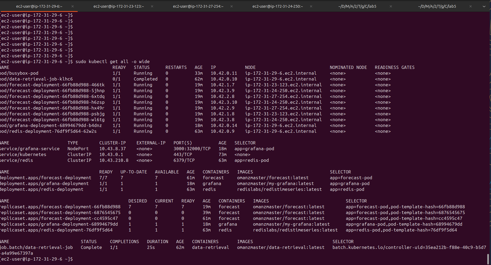
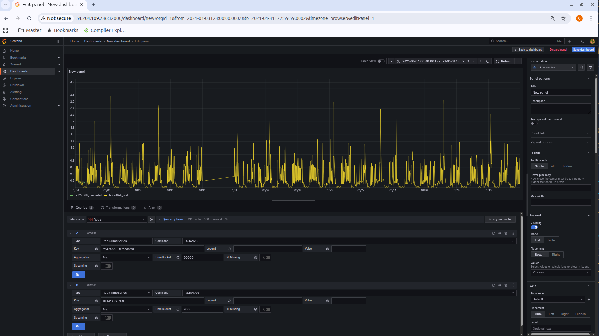

# Kubernetes lab

**Authors**: Olivia Manz and Samuel Roland in **Group D**

The whole project is available on this Github repository: https://github.com/samuelroland/CloudSys-labs/tree/main/lab5

## Introduction
We have just done the Kubernetes exercise where the forecasting was deployed to a "Kind" cluster.

For the lab, you will repeat the Kubernetes exercise but deploy all the services to a k3s cluster instead of a "Kind" Cluster. 

We will reuse the files from the previous exercise and deploy them on AWS.

## Create AWS instances
Sign in at AWS EC2 Console and create 4 instances:
- 1x: 2 CPU, 4GB RAM instance, 50GB, named `GroupD-control-pane`
- 3x: 1CPU, 2GB RAM at most, 30GB, named `control-worker-1`,`control-worker-2`, `control-worker-3`

A security group `launch-wizard-114` is automatically created. We will use the same key pair `Gd-control-plane.pem` for all instances.

To allow k3s to communicate between the master and worker nodes during installation, add a rule in the security group to allow TCP on port `6443`.
We can prepare the futur by adding:
- `UDP 8472` to allow the forecast service to push data to Redis (node-to-node communication)
- `TCP 32000` to allow access to the Grafana dashboard from outside the cluster.
To minimize exposure, restrict the source to the security group itself for `UDP 8472` and `TCP 6443`.


## Install k3s on control-pane
Connect to the `GroupD-control-plane` instance via SSH. The IP address (or SSH command) is available in the AWS console:
```sh
ssh -i "Gd-control-plane.pem" ec2-user@ec2-54-204-109-236.compute-1.amazonaws.com
```
Install k3s:
```sh
curl -sfL https://get.k3s.io | sh -
```
Verify the installation
```console
$ sudo k3s kubectl get nodes
NAME                          STATUS   ROLES                  AGE   VERSION
ip-172-31-29-6.ec2.internal   Ready    control-plane,master   70s   v1.33.5+k3s1
```
Display the node token for adding workers later:
```sh
sudo cat /var/lib/rancher/k3s/server/node-token
```

## Install k3s on workers
Connect to each worker via SSH and install k3s in agent mode, using the control plane IP and token:
```sh
curl -sfL https://get.k3s.io | K3S_URL=https://<IP-control-plane>:6443 K3S_TOKEN=<token-node> sh -
```
Repeat for all workers. On the control plane, verify the nodes:
```console
$ sudo k3s kubectl get nodes -o wide
NAME                            STATUS   ROLES                  AGE     VERSION        INTERNAL-IP     EXTERNAL-IP   OS-IMAGE                       KERNEL-VERSION                    CONTAINER-RUNTIME
ip-172-31-23-123.ec2.internal   Ready    <none>                 3m17s   v1.33.5+k3s1   172.31.23.123   <none>        Amazon Linux 2023.9.20251027   6.1.156-177.286.amzn2023.x86_64   containerd://2.1.4-k3s1
ip-172-31-24-250.ec2.internal   Ready    <none>                 2m22s   v1.33.5+k3s1   172.31.24.250   <none>        Amazon Linux 2023.9.20251027   6.1.156-177.286.amzn2023.x86_64   containerd://2.1.4-k3s1
ip-172-31-27-254.ec2.internal   Ready    <none>                 2m46s   v1.33.5+k3s1   172.31.27.254   <none>        Amazon Linux 2023.9.20251027   6.1.156-177.286.amzn2023.x86_64   containerd://2.1.4-k3s1
ip-172-31-29-6.ec2.internal     Ready    control-plane,master   7m57s   v1.33.5+k3s1   172.31.29.6     <none>        Amazon Linux 2023.9.20251027   6.1.156-177.286.amzn2023.x86_64   containerd://2.1.4-k3s1
```

## Prepare nodes
As we should install grafana, redis and data-retrieval on the master and forecast on the workers, we label each node:
```sh
sudo k3s kubectl label node ip-172-31-29-6.ec2.internal role=control-plane
sudo k3s kubectl label node ip-172-31-23-123.ec2.internal role=worker
sudo k3s kubectl label node ip-172-31-24-250.ec2.internal role=worker
sudo k3s kubectl label node ip-172-31-27-254.ec2.internal role=worker
```
We can check the result:
```console
$ sudo k3s kubectl get nodes --show-labels
NAME                            STATUS   ROLES                  AGE     VERSION        LABELS
ip-172-31-23-123.ec2.internal   Ready    <none>                 3m28s   v1.33.5+k3s1   beta.kubernetes.io/arch=amd64,beta.kubernetes.io/instance-type=k3s,beta.kubernetes.io/os=linux,kubernetes.io/arch=amd64,kubernetes.io/hostname=ip-172-31-23-123.ec2.internal,kubernetes.io/os=linux,node.kubernetes.io/instance-type=k3s,role=worker
ip-172-31-24-250.ec2.internal   Ready    <none>                 2m33s   v1.33.5+k3s1   beta.kubernetes.io/arch=amd64,beta.kubernetes.io/instance-type=k3s,beta.kubernetes.io/os=linux,kubernetes.io/arch=amd64,kubernetes.io/hostname=ip-172-31-24-250.ec2.internal,kubernetes.io/os=linux,node.kubernetes.io/instance-type=k3s,role=worker
ip-172-31-27-254.ec2.internal   Ready    <none>                 2m57s   v1.33.5+k3s1   beta.kubernetes.io/arch=amd64,beta.kubernetes.io/instance-type=k3s,beta.kubernetes.io/os=linux,kubernetes.io/arch=amd64,kubernetes.io/hostname=ip-172-31-27-254.ec2.internal,kubernetes.io/os=linux,node.kubernetes.io/instance-type=k3s,role=worker
ip-172-31-29-6.ec2.internal     Ready    control-plane,master   8m8s v1.33.5+k3s1   beta.kubernetes.io/arch=amd64,beta.kubernetes.io/instance-type=k3s,beta.kubernetes.io/os=linux,kubernetes.io/arch=amd64,kubernetes.io/hostname=ip-172-31-29-6.ec2.internal,kubernetes.io/os=linux,node-role.kubernetes.io/control-plane=true,node-role.kubernetes.io/master=true,node.kubernetes.io/instance-type=k3s,role=control-plane
```

As asked in the instructions, we want to have all the pods on the control-plane node and except for the Forecast pods on the worker nodes. To achieve this, we changed the deployment yaml files and to add a `nodeSelector` that makes it possible to select the node by role.
```yaml
spec:
  template:
    spec:
      nodeSelector:
        role: control-plane
```
For `forecast-deployment.yaml`, we did the same thing with `role: worker`.

For Grafana, we changed the service type to `NodePort` to allow external access:
```yaml
apiVersion: v1
kind: Service
metadata:
  name: grafana-service
spec:
  type: NodePort
  ports:
  - port: 3000
    targetPort: 3000
    nodePort: 32000   # port available from outside
  selector:
    app: grafana-pod
```

## Deploying the Services
We decide to copy deployment files on control-plane node and run these commands locally to upload the folder `deployment` under `/home/ec2-user/`.
```sh
scp -i Gd-control-plane.pem -r deployment ec2-user@54.204.109.236:/home/ec2-user/
```
On the control-plane node, we deployed Redis:
```sh
sudo k3s kubectl apply -f /home/ec2-user/deployment/redis-deployment.yaml
```
Like before, we created a secret for AWS credentials
```sh
kubectl create secret generic <name-of-the-secrets> \
  --from-literal=AWS_ACCESS_KEY_ID=<Your access key> \
  --from-literal=AWS_SECRET_ACCESS_KEY=<your secret key>
```
We then deployed Data-Retrieval:
```sh
sudo k3s kubectl apply -f /home/ec2-user/deployment/data-retrieval-deployment.yaml
```
We check that data-retrieval has finished its execution before deploying the forecast module. 
```sh
sudo k3s kubectl apply -f /home/ec2-user/deployment/forecast-deployment.yaml
```
Finally, we deployed Grafana:
```sh
sudo k3s kubectl apply -f /home/ec2-user/deployment/grafana-deployment.yaml 
```

We verified the status of all pods and here is the full output of `sudo kubectl get all -o wide` in screenshot.



We accessed Grafana through the public IP of the control-plane node on port 32000. The following screenshot shows the result after the dashboard configuration.



## Difficulty
The main difficulty during this lab was knowing whether a rule was necessary to add to the security group. Particularly for the rule allowing the Forecast service to send data to Redis.

